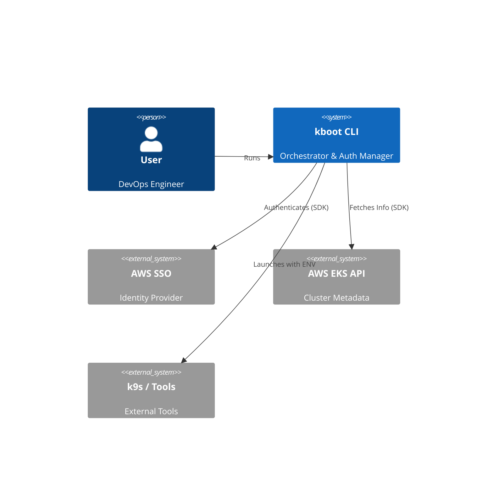

# Arquitetura e Componentes - kboot

## Visão Geral
A arquitetura evoluirá de um script monolítico para uma aplicação modular em Go, estruturada para suportar concorrência, uso do AWS SDK v2 e interfaces ricas (TUI).

## Estrutura de Diretórios (Proposta)
```text
kboot/
├── cmd/
│   └── kboot/          # Entrypoint principal (main.go)
├── internal/
│   ├── app/            # Lógica de orquestração (BootFlow, ParallelExec)
│   ├── aws/            # AWS SDK v2 Wrappers (Identity, EKS, SSO)
│   ├── config/         # Gerenciamento de configuração (~/.kboot.yaml)
│   ├── kube/           # Geração de Kubeconfig
│   └── ui/             # Componentes TUI (Bubbletea) para loading/config
└── docs/               # Documentação
```

## Componentes Principais

### 1. **Orchestrator (Application Layer)**
- **Responsabilidade:** Coordenar o fluxo de inicialização.
- **Funcionalidades:**
    - Ler configuração.
    - Inicializar Worker Pool.
    - Gerenciar estado global (clusters falhos vs. sucesso).
    - Decidir o output final (k9s, shell ou apenas arquivo).

### 2. **AWS Provider (Infrastructure Layer)**
- **Tecnologia:** **AWS SDK for Go v2**.
- **Módulos:**
    - `SSOClient`: Valida sessões e dispara login se necessário (interage com `~/.aws/config`).
    - `EKSClient`: Recupera endpoint, certificado e ARN do cluster (`DescribeCluster`).
    - `STSClient`: Valida identidade atual (`GetCallerIdentity`).
- **Cache Strategy:** O SDK gerencia cache de tokens automaticamente.

### 3. **UI/Feedback (Presentation Layer)**
- **Tecnologia:** **Bubbletea** + **Lipgloss**.
- **Componentes:**
    - `LoadingModel`: Tela de progresso com spinners por cluster/worker.
    - `ConfigManager`: A interface atual de gerenciamento (já existente em `manage.go`) será refatorada para este pacote.

### 4. **Kube Generator (Domain Layer)**
- **Responsabilidade:** Gerar arquivos YAML de kubeconfig sem depender de `kubectl`.
- **Output:** Escreve em diretório temporário (`/tmp/kboot/...`).

## Diagrama de Contexto (C4)

